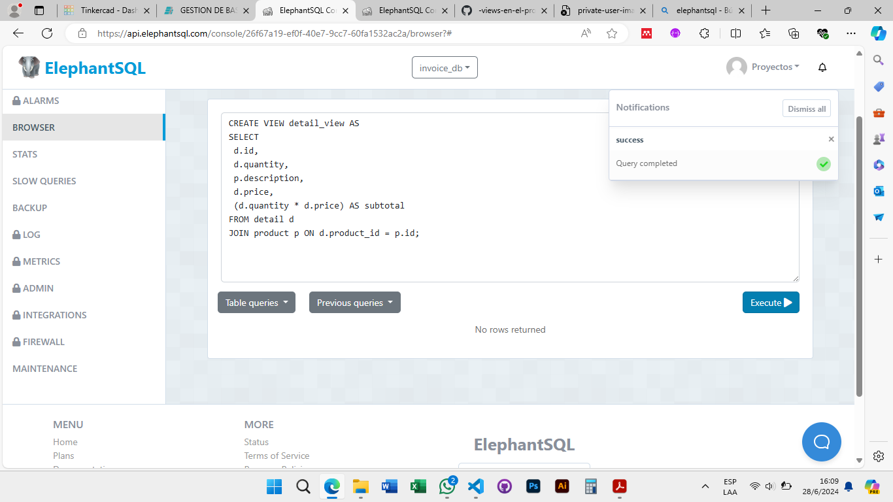

# TAS11 - Views projects
## 1. Primer VIEW.
  - Sentencia:
  ```
  CREATE VIEW invoice_view AS
  SELECT
   i.id,
   i.code,
   i.create_at,
   i.total,
   c.fullname
  FROM invoice i
  JOIN client c ON i.client_id = c.id;
  ```
  - Captura:


## 2. Segundo VIEW.
  - Sentencia:
  ```
  CREATE VIEW detail_view AS
  SELECT
   d.id,
   d.quantity,
   p.description,
   d.price,
  (d.quantity * d.price) AS subtotal
  FROM detail d
  JOIN product p ON d.product_id = p.id;
  ```
  - Captura:



